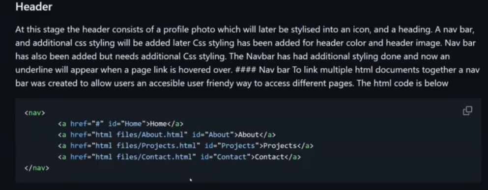

# Key Notes
FOr the purpose of this website 

- extra small device 600px and down 
- medium devices tablets 768px and up 
- extra large 1200px and up
As suggested on (W3 schools, 2025)  available here link

# Wireframes

Home page: T.,..,.,

About page: khjjhv

Project page: jh

# Overview

This Website was created to create a readable Portfolio as part of an Assessment for . 
The website has a home page, about page, sldjhfg page, and lsdhjbf page.

## Components

# Header

lajdhbflajhbf

# Animation 

Add code pic also

# Footer

lajdhbflajhbf

# Home Body

lajdhbflajhbf

# About page etc

lajdhbflajhbf

# Placeholders

lajdhbflajhbf

# Reference

lajdhbflajhbf

I thought these were professional looking.
- Colours are great
- Crisp edges

# Here are my Wireframes.

They were designed on Balsamiq.

# Colour Theme Planning
## Here are some Colours I thought would be great for the Site.

Black for Background

#242834

Blue sky and water at the beach or the park

#095B93

Green is the colour of grass and parks

#489AC2

Sun shining and light reflecting

#C4B0A9

Orange colour warmth

#FFCC57

Thank you!